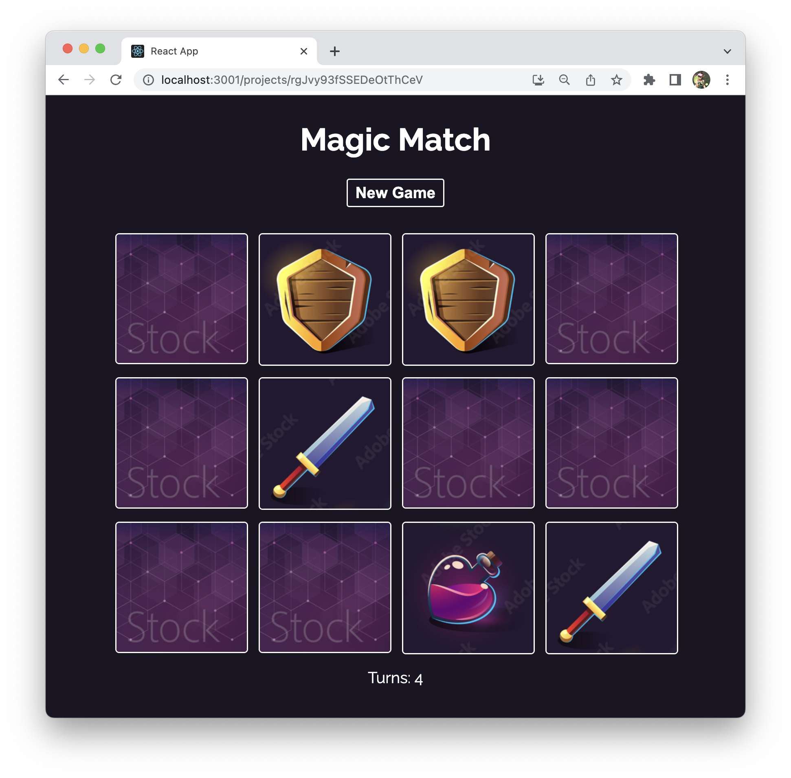

# Magic Memory

A magic-memory card game project created following https://www.udemy.com/course/build-web-apps-with-react-firebase/

## Technologies

- Javascript: setTimeout
- React: useState, useEffect
- CSS: transform, transition